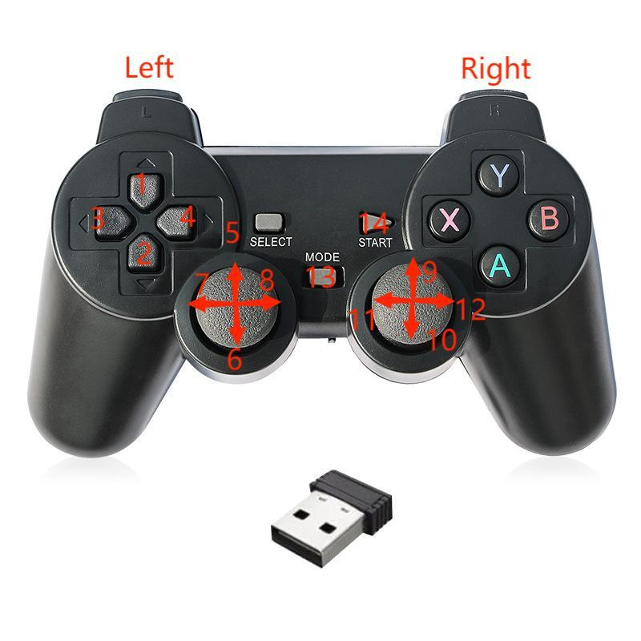

# instructions

## 1.Connecting devices

Connect the MyCobot and handle to the computer.

## 2.Install required libraries

Open the terminal, switch the path to this folder, and run the following command。

```bash
pip3 install -r requirements.txt
```

## 3.Modify port number

Edit the handle_control.py file

```python
import pygame
import time
from pymycobot import MyCobot
import threading
# Change com7 to the port number detected by your computer
mc = MyCobot("com7")
...
```

Finally. run the program.

```bash
python3 handle_control.py
```

> Note: After running the program, first click the **14** button to check the machine connection status, the machine connection status is normal (if it is abnormal, you will not be able to perform other operations, please solve the abnormal connection problem first), and then click **Right 1** button, other operations can only be performed after the machine reaches the initial point.



The corresponding functions of the handle buttons are as follows:

- **1**: RX direction coordinate value increases
- **2**: RX direction coordinate value decreases
- **3**: RY direction coordinate value decreases
- **4**: RY direction coordinate value increases
- **5**: X direction coordinate value increases
- **6**: X direction coordinate value decreases
- **7**: Y direction coordinate value decreases
- **8**: Y direction coordinate value increases
- **9**: Z direction coordinate value increases
- **10**: Z direction coordinate value decreases
- **11**: RZ direction coordinate value decreases
- **12**: RZ direction coordinate value increases
- **13**: Wake up the handle. After the handle is not used for a long time after connection, it will enter sleep mode. You need to press this button to wake up.
- **14**: Check the connection status of the machine. The atom LED flashes green three times to indicate that the machine is normal; flashes red three times to indicate that the state is abnormal.
- **X**: Press and hold the button, the jaws continue to open
- **Y**: Press and hold the button, the jaws continue to close
- **A**: open suction pump
- **B**: Shut down the suction pump
- **Left 1**: Press and hold for 2s to initialize the robot to the joint zero state.
- **Left 2**: Press and hold for 2s, the robot stops torque output and relaxes all joints.
- **Right 1**: Press and hold for 2s to initialize the robot to move to the initial point.
- **Right 2**: Press and hold for 2s, the robot turns on the torque output, and all joints are locked

# 使用说明

## 1.连接设备

将MyCobot和手柄连接到电脑。

## 2.安装所需的包

打开终端，切换路径到此文件夹，运行如下指令：

```bash
pip3 install -r requirements.txt
```

## 3.修改端口号

编辑 handle_control.py 文件

```python
import pygame
import time
from pymycobot import MyCobot
import threading
# 将com7修改为你的电脑检测到的实际端口号
mc = MyCobot("com7")
...
```

最后，运行程序即可。

```bash
python3 handle_control.py
```

> 注意：在运行程序以后，首先要先点击**14**按钮，检查机器连接状态，机器连接状态正常(若为异常，将无法进行其他的操作，请先解决连接异常问题)，再点击**Right 1**按钮，机器到达初始点位以后，才可以进行其他的操作。

手柄按钮对应功能如下：

- **1**: RX方向坐标值增加
- **2**: RX方向坐标值减小
- **3**: RY方向坐标值减小
- **4**: RY方向坐标值增大
- **5**: X方向坐标值增加
- **6**: X方向坐标值减小
- **7**: Y方向坐标值减小
- **8**: Y方向坐标值增加
- **9**: Z方向坐标值增加
- **10**: Z方向坐标值减小
- **11**: RZ方向坐标值减小
- **12**: RZ方向坐标值增加
- **13**: 唤醒手柄，手柄连接以后长时间不使用会进入休眠，需要按下此键来唤醒
- **14**: 检测机器连接状态，atom LED闪烁绿灯三次表示机器正常，闪烁红灯三次表示状态异常。
- **X**: 夹爪累加张开
- **Y**: 夹爪累加关闭
- **X**: 打开吸泵
- **X**: 关闭吸泵
- **Left 1**: 长按2s，初始化机器人至关节零位状态。
- **Left 2**: 长按2s，机器人停止力矩输出，放松所有关节。
- **Right 1**: 长按2s，初始化机器人至移动初始点位。
- **Right 2**: 长按2s，机器人打开力矩输出，所有关节锁定。
